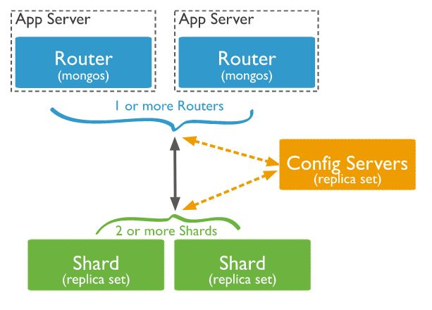
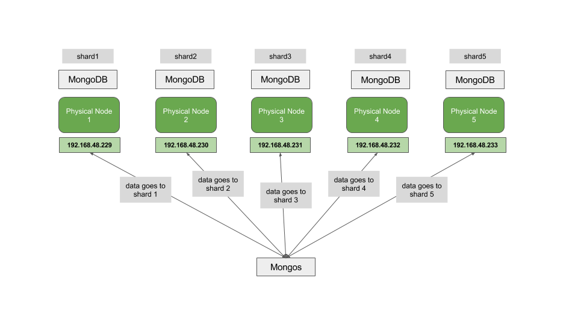
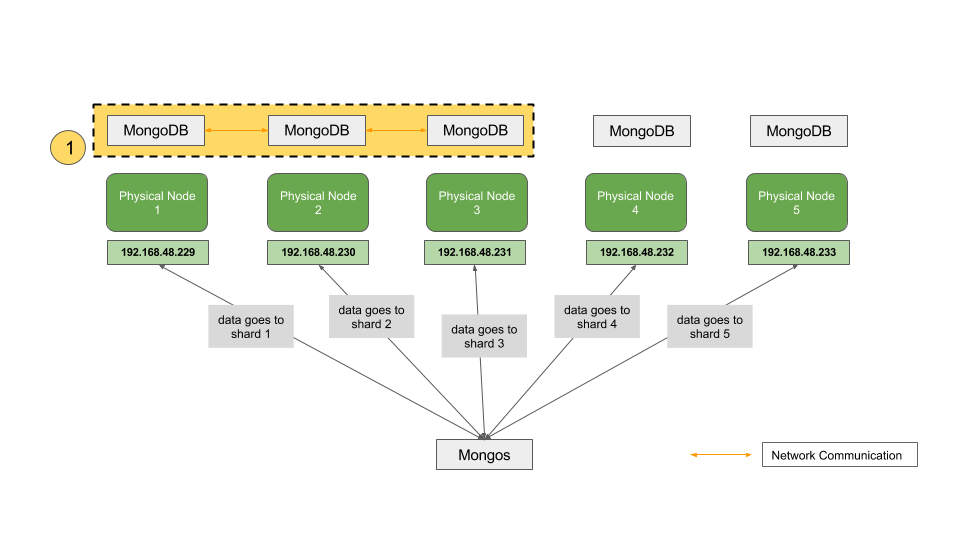
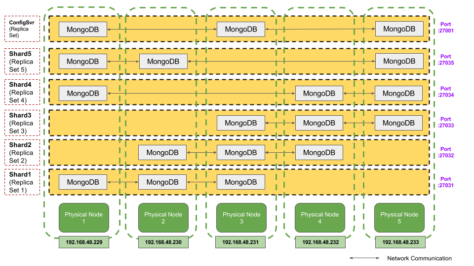
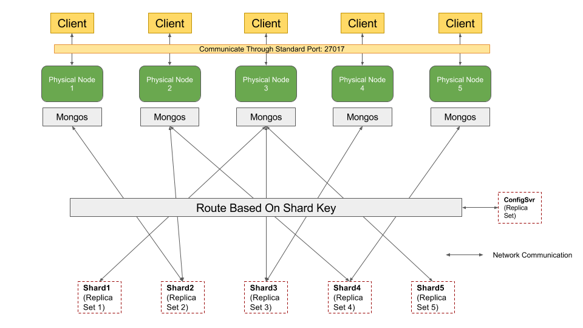

# Mongodb

[](https://travis-ci.org/DistributedTeam/MongoDB)

[](https://ci.appveyor.com/project/xpdavid/mongodb)

[](https://coveralls.io/github/DistributedTeam/MongoDB?branch=master)


### General Instruction

The term "project root" is used in the document to refer to the level of folder structure where this `README.md` file is located.

This project is built using `gradlew`. 

For Windows users, use `gradlew.bat` at project root. 

For Linux/Mac users, use `gradlew` at project root. 

In the following sections, this script is referred to generally as `gradlew`.

### Prerequisite
- [MongoDB](https://www.mongodb.com/download-center)
- [Java 8](http://www.oracle.com/technetwork/java/javase/downloads/jdk8-downloads-2133151.html) and above
- RAM memory of 8GB and above (to massage the given data file successfully)
- A stable connection to the Internet
- Git Bash (for Windows users)

For Windows users, ensure that paths to Java 8 are correctly added to `System Properties` > `Advanced` > `Environment Variables` > `PATH`.

### Prepare and Denormalize Data
Download zipped data files from [http://www.comp.nus.edu.sg/~cs4224/4224-project-files.zip](http://www.comp.nus.edu.sg/~cs4224/4224-project-files.zip).

Unzip the data files and put folders `data-files` and `xact-files` and the csv file inside under folder `project-files` at project root.

Run command `gradlew massage:run` at project root.

### Configure Node
As specified by project requirement, data should be distributed across all 5 cluster nodes using horizontal partition, with a replication factor of 3.



As shardings (data partition) in MongoDB are distributed based on communication between `mongos` and config servers, as shown in the figure above, data will go to corresponding `mongod` (replica set) in each shard  

Distributing data across all 5 nodes can be easily achieved since 5 physical machines are available. `mongos` can be deployed on each machine, which will take care of the routing of data to the 5 physical machines.


However, as data that go to each shard should have 2 additional copies in other machines and data replication level in MongoDB is in database level, single instance of `mongod` in each machine is not sufficient. 



In the case of using single instance of `mongod` without replication, data is stored in each physical node as a unique shard. 



However, as shown in the naive implementation above, when shard1, shard2 and shard3 form a replica set, they are no longer recognized by Mongo as 3 shards, but a single shard instead. Under this situation, there is no way data in shard4 and shard5 can have 3 copies of their data distributed across 3 different physical nodes, given the assumption that data should be evenly distributed.  
 
A solution is deviced to ensure that the requirement on replication is achieved, shown in the diagram below.



In the sharding configuration, each physical node owns 3 `mongod` instance, forming `shard1`, `shard2` ... `shard5` replica sets on different ports. This ensures that data going to each shard is stored in 3 physical machines. Config server has a replica factor of 3 as well, the `mongod` instances for config server replica set are randomly chosen across all physical nodes.



Routing is then done based on shard keys.

To simplify the tedious procedure of manually setting up configurations of all nodes, a program is written to automate the process.

To configure the program, edit `project.properties` in folder `nodesetup` at project root.

Note that running the setup will bring down all the `mongod` and `mongos` instances by shell command `pkill 'mongod' && pkill 'mongos'`. 

``` bash
# Set server IP addresses to be the ones used for experiment. Exactly 5 working IP addresses are required in order for the above mentioned setup to work
server.ips = 192.168.48.229, 192.168.48.230, 192.168.48.231, 192.168.48.232, 192.168.48.233

# Fill up the correct SSH user and password for the node
ssh.user = 
ssh.password = 

# Determine the location where mongodb is placed. It is by default that any previous content under this folder will be overwritten whenever the NodeSetup is run
base.folder.overwrite = true
base.folder = /temp/mongodb

# The db should be the same db used to import or the sharding won't take effect. shard.collection should not be modified.
shard.db = cs4224c
shard.collections = customer, district, orderItem, stock

# Set the option to be true only when read concern in client configuration is set to majority
mongodb.enable.majority.read.concern = false
```

Run `gradlew nodesetup:run` at project root.

A set of output will be shown to signal the success or failure of node setup. When the setup finishes successfully, logging information below will be shown.

> NodeSetup complete! You may start to import now. DB are available through port 27017 in the servers

In case of error, please double check on the node IP addresses and user credentials. 

Note that the setup can fail due to poor network conditions, please re-run the command in this case.

A sample of node configuration files based on IP addresses of nodes assigned to us is available in folder `node-settings` at project root. 

`replicaX-1`,`replicaX-2` and `replicaX-3` refer to shard X.

`portY.js` corresponds to init script for replica set running on port Y.
 
Settings for config server and mongos are available in folder `configsvr` and `mongos` respectively. 

Init script under fold `shard` initializes all shards and enable them on database.

To ensure correctness of the configuration procedure, it is not suggested to alter any other parts of the configuration.

##### Manual Setup

Manual setup on the above mentioned procedure is possible however not recommended. Please contact us if you would like to know more details about it.    

### Import Data To Project

Make sure `gradlew massage:run` command is executed successfully before this step.

The `gradlew` script assumes by default that MongoDB runs on IP address `192.168.48.229:27017`. 

To change default IP address, change `mongodb.ip` in file `import/project.properties`. 

If more than one node is involved, the IP address could be from any one of the nodes.

Run command `gradlew import:all` at project root.

This command performs `import:clearCollection`, `import:importData` and `import:createIndex` sequentially. 

### Run Experiments

To change read and write concern of clients, edit `mongod.read.concern` and `mongod.write.concern` in file `project.properties` under folder `client` at project root accordingly.

Note that `mongodb.ip` is purposely left blank as it will be overwritten by the ip addresses in file `start-experiment` mentioned below.

Note that if `mongod.read.concern` is set to majority, please ensure that `mongodb.enable.majority.read.concern` in file `project.properties` under folder `nodesetup` at project is changed to true and the nodeSetup is re-run under the configuration.

The file `start-experiment` at project root includes configuration of clients.

The default IP addresses of the nodes are those of nodes allocated to our group. 

The IP addresses can be changed by modifying the value of `hosts` in `start-experiment` file.

The default number of clients is 10. 

To change the number of clients, modify the upper range of loop variable `i`.

Example:

Changing the code from

```
for i in {1..10}
```

to

``` 
for i in {1..20}
```

will increase the number of clients from 10 to 20.

It is suggested that the upper range of loop variable `i` in file `stop-experiment` at project root is changed to the same value as in `start-experiment` to ensure consistency and success in premature termination of clients.

**To run experiment:** Run `./start-experiment` at project root. 
(For Windows users, execute the command using Git Bash.)

**To stop experiment:** Run `./stop-experiment` at project root. 
(For Windows users, execute the command using Git Bash.) 

(You can check that the experiment is running by checking the log files where partial logs have been produced, for more details please refer to the section right below.)

**To view experiment logs:** Go to folder `experiment_log` at project root, where log files including output from client, error logs and statistics such as number of transaction completed and throughput etc. are positioned. 


Note that when a large number of clients is run (especially the experiment where 40 clients are required), one computer might not be sufficient to run all the clients. More than one computer might be required based on specifications of the computer.

### Check Database State

Add a working IP address from any of the 5 nodes to `mongodb.ip` in file `project.properties` under folder `client`. 

To output database state, run command `gradlew client:run -q` at project root and type `DATABASE` to view the result. Note that you may enter any query from the command prompt / terminal specified by in the project. Results of these queries will be output to the screen.

To exit the client, press `Ctrl + D` (EOF signal) and the statistics of database will be displayed.

**Note:** If read and write concern is set to majority, you need to change `mongodb.read.concern` to `local` and `mongodb.write.concern` to `1` as MongoDB mapReduce does not support majority read and write concern. 

  
### Verification

To verify that the project is correctly set up, refer to [`test.md`](test.md) at project root for more details.
